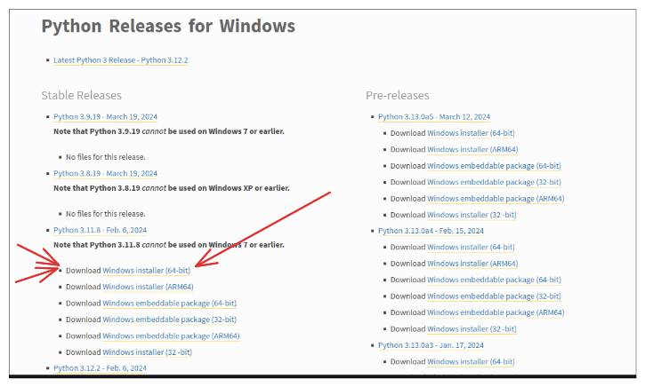
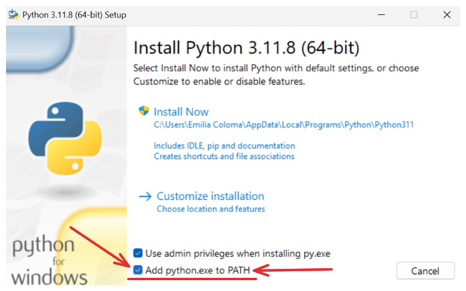
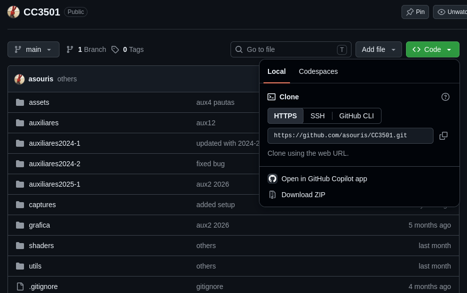

 ✩ Al terminar de instalar todas las herramientas, vayan al **FINAL** del instructivo, donde verán como probar todo junto y ejecutar un ejemplo. Esto será válido para todos los sistemas operativos.

## Windows

### Python

Descargamos la ultima version estable de Python aquí: https://www.python.org/downloads/windows/


Abrimos el instalador y **TENEMOS** que seleccionar `Add python.exe to PATH`, si no lo hacen tienen que empezar de nuevo la instalación :)

Cuando la instalación termine, habren una terminal y escriben:

``` bash
python
```

Si todo está bien deberían obtener lo siguiente o algo similar.

``` bash
Python 3.11.8 (tags/v3.11.8:db85d51, Feb  6 2024, 22:03:32) [MSC v.1937 64 bit (AMD64)] on win32
Type "help", "copyright", "credits" or "license" for more information.
>>
```

No queremos usar esto asi que cierrenlo con

``` python
>>> exit()
```

### UV
[UV](https://docs.astral.sh/uv/) es un gestor de paquetes para python. Nos permitirá distribuirles una lista de librerías necesaria para ejecutar el material de referencia.
Para instalarlo ejecuten lo siguiente en una terminal:
``` bash
powershell -ExecutionPolicy ByPass -c "irm https://astral.sh/uv/install.ps1 | iex"
```

Al escribir y ejecutar `uv` en la terminal, deberían ver lo siguiente:
``` bash
> uv
An extremely fast Python package manager.

Usage: uv [OPTIONS] <COMMAND>
...
```

### Git
[Git](https://git-scm.com/) es un sistema de control de versiones que usaremos junto a la plataforma [Github](https://github.com/) para distribuirles los códigos de ejemplos y las pautas a los auxiliares. Instalen Git con:

``` zsh
winget install --id Git.Git -e --source winget
```
O en su defecto, pueden descargarlo de la siguiente página web: https://git-scm.com/install/windows

### Clonar repositorio
Esto se refiere a obtener una copia de todo el código que está disponible en un espacio de Github o "repositorio". Para esto usamos `git`. Primero copian el link, el cual es "https://github.com/asouris/CC3501.git", y ejecutan en una terminal:
``` zsh
git clone "https://github.com/asouris/CC3501.git"
```

Esto les creará una carpeta llamada `CC3501` donde estará todo el material de referencia que pueden usar.

También pueden descargar el repositorio como un `zip` abriendo el link en un navegador y descargandolo desde el boton verde.



## MacOs

### Python
Mac viene con una version antigua de python (python2). Si escriben en la terminal:

``` zsh
python3
```

Podria ser que
1. Tengan python y vean algo asi:

``` zsh
Python 3.6.6 (default, Sep 12 2018, 18:26:19)
[GCC 8.0.1 20180414 (experimental) [trunk revision 259383]] on linux
Type "help", "copyright", "credits" or "license" for more information.
>>>
```

2.  No lo tengan y pero tengan xcode y se ponga a instalarlo
3.  No lo tenga y punto

Si son el caso 3. vamos a instalarlo con **brew**. Vean si ya tienen brew con

``` zsh
brew
```

Si les dice que no conoce el comando lo instalan, si ya lo tenian sigan con la instalación.
Instalar brew es muy simple, sigan las instrucciones que hay en https://brew.sh/ *(copian lo que les dice y lo ponen en la terminal)*

Ahora instalan **python** con:

``` zsh
brew install python3
```

### UV
[UV](https://docs.astral.sh/uv/) es un gestor de paquetes para python. Nos permitirá distribuirles una lista de librerías necesaria para ejecutar el material de referencia.
Para instalarlo ejecuten lo siguiente en una terminal:
``` zsh
curl -LsSf https://astral.sh/uv/install.sh | sh
```

Al escribir y ejecutar `uv` en la terminal, deberían ver lo siguiente:
``` zsh
> uv
An extremely fast Python package manager.

Usage: uv [OPTIONS] <COMMAND>
...
```


### Git
[Git](https://git-scm.com/) es un sistema de control de versiones que usaremos junto a la plataforma [Github](https://github.com/) para distribuirles los códigos de ejemplos y las pautas a los auxiliares. Instalen Git con:

``` zsh
brew install git
```

### Clonar repositorio
Esto se refiere a obtener una copia de todo el código que está disponible en un espacio de Github o "repositorio". Para esto usamos `git`. Primero copian el link, el cual es "https://github.com/asouris/CC3501.git", y ejecutan en una terminal:
``` zsh
git clone "https://github.com/asouris/CC3501.git"
```

Esto les creará una carpeta llamada `CC3501` donde estará todo el material de referencia que pueden usar.

También pueden descargar el repositorio como un `zip` abriendo el link en un navegador y descargandolo desde el boton verde.


## Linux (Debian/Ubuntu)

### Python
Primero vemos si tenemos python. Ejecuten:

``` bash
python3
```

Podria ser que
1. Tengan python y vean algo asi:

``` bash
Python 3.6.6 (default, Sep 12 2018, 18:26:19)
[GCC 8.0.1 20180414 (experimental) [trunk revision 259383]] on linux
Type "help", "copyright", "credits" or "license" for more information.
>>>
```

2.  Les tire error y no lo tienen

Si no tienen python instalado, ejecuten en el mismo orden lo siguiente (esto no es válido para todos los gestores de paquetes...):

``` bash
sudo apt-get update
sudo apt-get install python3 python3-dev python3-pip python3-venv
```

### UV
[UV](https://docs.astral.sh/uv/) es un gestor de paquetes para python. Nos permitirá distribuirles una lista de librerías necesaria para ejecutar el material de referencia.
Para instalarlo ejecuten lo siguiente en una terminal:
``` zsh
curl -LsSf https://astral.sh/uv/install.sh | sh
```

Al escribir y ejecutar `uv` en la terminal, deberían ver lo siguiente:
``` zsh
> uv
An extremely fast Python package manager.

Usage: uv [OPTIONS] <COMMAND>
...
```


### Git
[Git](https://git-scm.com/) es un sistema de control de versiones que usaremos junto a la plataforma [Github](https://github.com/) para distribuirles los códigos de ejemplos y las pautas a los auxiliares. Instalen Git con el siguiente comando (o con su gestor de paquetes favorito....):

``` bash
sudo apt-get install git
```

### Clonar repositorio
Esto se refiere a obtener una copia de todo el código que está disponible en un espacio de Github o "repositorio". Para esto usamos `git`. Primero copian el link, el cual es "https://github.com/asouris/CC3501.git", y ejecutan en una terminal:
``` zsh
git clone "https://github.com/asouris/CC3501.git"
```

Esto les creará una carpeta llamada `CC3501` donde estará todo el material de referencia que pueden usar.

También pueden descargar el repositorio como un `zip` abriendo el link en un navegador y descargandolo desde el boton verde.


## Probando un ejemplo (para todos los sistemas)

Abran una terminal y se mueven hasta la carpeta CC3501. 
Para ello usan el comando `cd`. Por ejemplo si mi carpeta CC3501 está en mi escritorio haría lo siguiente:

en windows:
``` zsh
cd Desktop\CC3501
```

en macos o linux:
``` zsh
cd ~/Desktop/CC3501
```

Ahora pueden ejecutar un ejemplo con:
``` zsh
uv run triangulo.py 
```

Si todo sale bien deberia habrirse una ventana y veriamos algo así:

